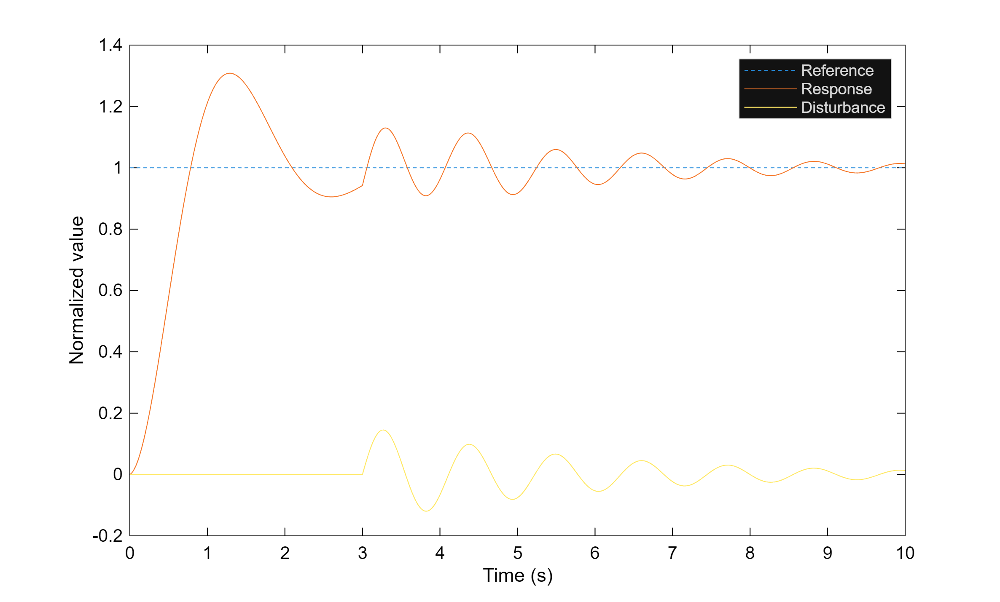
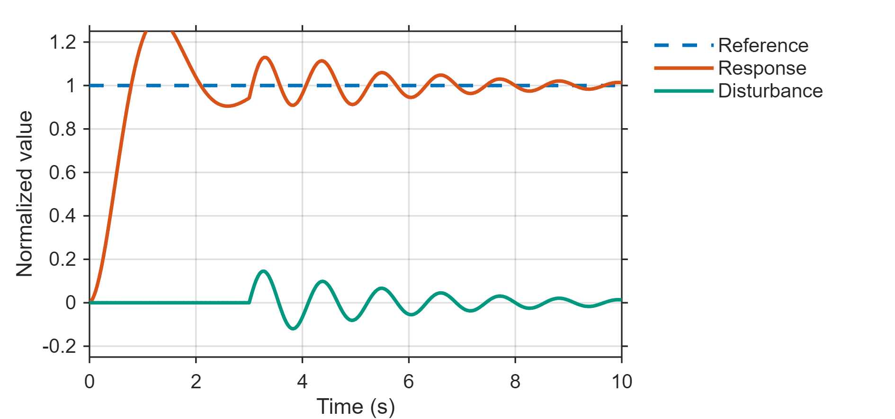
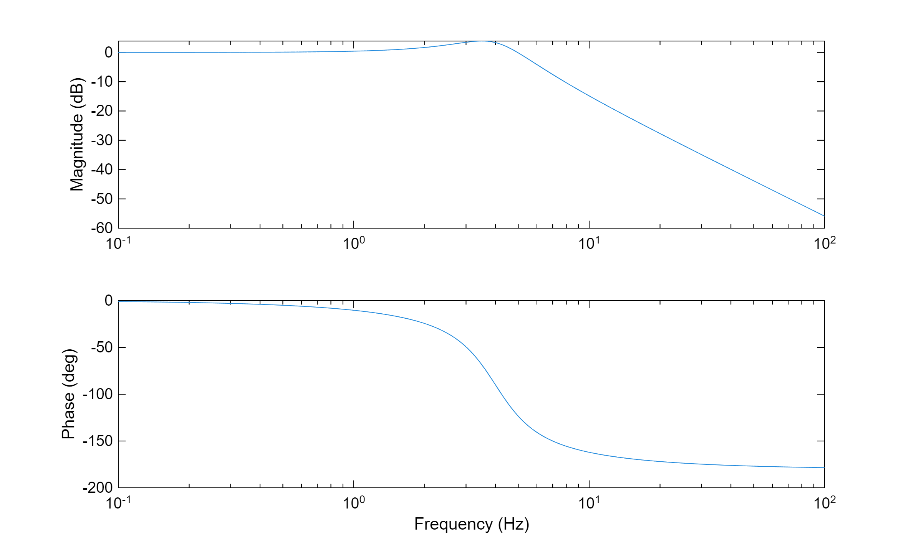
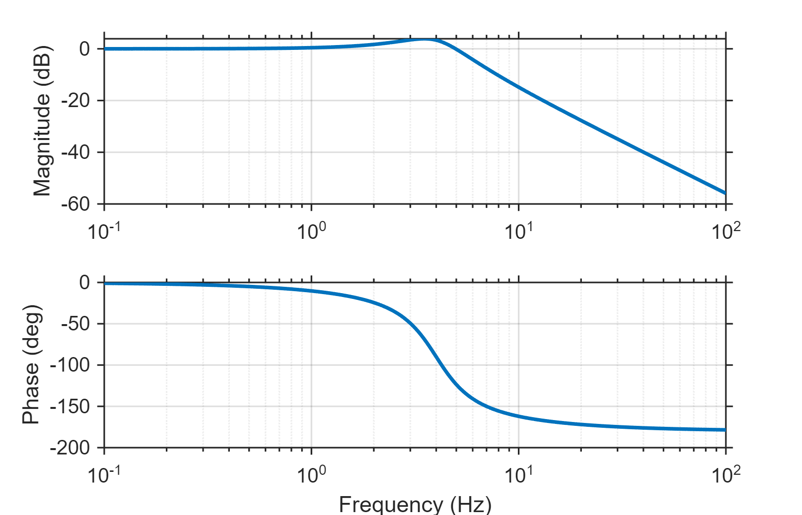
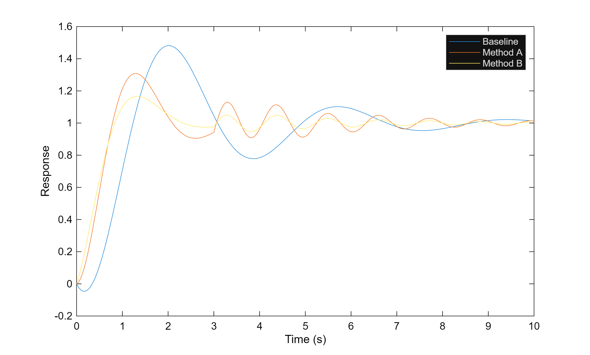
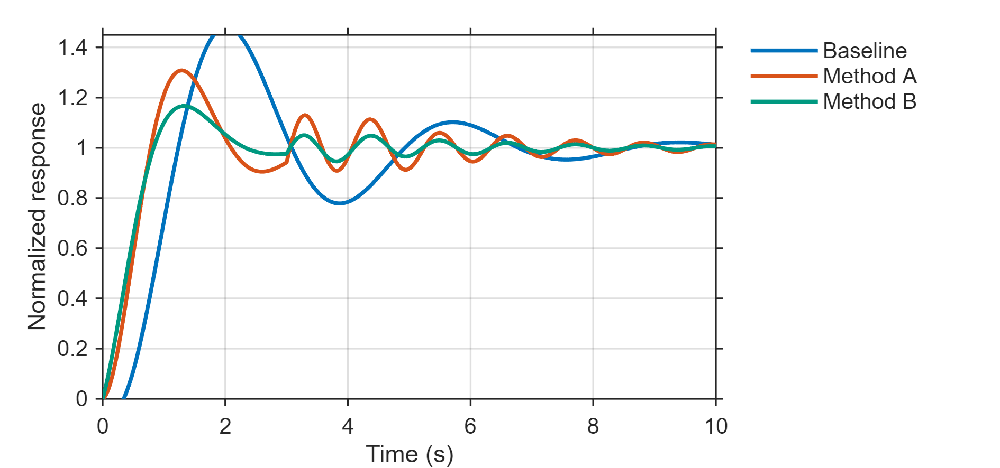

# MATLAB Research Plot Helper

A small MATLAB toolkit for publication-style research plots using synthetic examples.

It provides reusable plotting style helpers, export utilities, and deterministic sample data to show how default MATLAB figures can be turned into cleaner figures for papers, reports, slides, and LaTeX workflows.

All data in this repository are synthetic. They do not represent any experiment, compressor, test rig, unpublished manuscript, or real equipment.

## Quick Start

From the repository root, run:

```matlab
run("matlab/runAllDemos.m")
```

This generates synthetic CSV files and exports before/after figures into:

```text
examples/before/
examples/after/
```

## Examples

### Time-Series Plot

Default MATLAB style:



Research style:



### Frequency-Response-Like Plot

Default MATLAB style:



Research style:



### Method Comparison Plot

Default MATLAB style:



Research style:



## What Is Included

- `applyResearchPlotStyle.m`: consistent fonts, axes, grid, line widths, legend style, and color order
- `exportResearchFigure.m`: export PNG, PDF, and SVG with a fallback for older MATLAB versions
- `generateSyntheticData.m`: deterministic synthetic data generation
- `demoTimeSeriesPlot.m`: synthetic reference/response/disturbance figure
- `demoFrequencyResponsePlot.m`: synthetic magnitude/phase figure
- `demoComparisonPlot.m`: synthetic baseline/method comparison figure
- `runAllDemos.m`: one-command demo runner

## When To Use

- You want consistent MATLAB figures for a paper, report, slide deck, or technical note.
- You need a reusable baseline for line plots, comparison plots, and frequency-response-like plots.
- You want publication-style export defaults without setting figure properties manually every time.

## When Not To Use

- Do not treat the synthetic data as a physical model or experiment.
- Do not use this repository to publish private or unpublished research data.
- Do not use the example curves as compressor, test-rig, or controller evidence.
- Do not claim the plots reproduce a real system.

## Validation

Run the public asset check:

```bash
python scripts/validate_public_assets.py
```

The script checks that expected files exist, outputs are non-empty, and public files do not contain obvious private paths, contact information, or credential strings.

## Suggested GitHub Topics

```text
matlab
research-tools
data-visualization
academic-writing
engineering
plotting
publication
latex
```

## Privacy Boundary

This repository is intentionally public-safe:

- no real experiment data
- no thesis or manuscript figures
- no real test-rig parameters
- no local research paths
- no private correspondence or personal information

The examples are only synthetic plotting fixtures.
